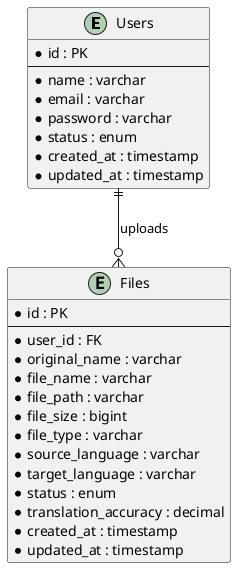
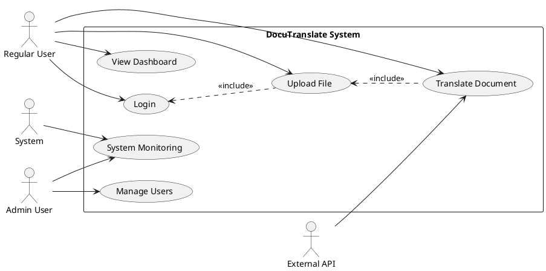

# DocuTranslate Visual Diagrams

## 🎨 How to Convert These to Visual Diagrams

### 📊 **For ER Diagram**

#### **Recommended Tools:**
1. **Draw.io (diagrams.net)** - Free online tool
2. **Lucidchart** - Professional diagramming
3. **MySQL Workbench** - Database-specific
4. **dbdiagram.io** - Database schema visualization
5. **Visual Studio Code** with ER Diagram extensions

#### **Steps to Create Visual ER Diagram:**
1. **Open Draw.io**
2. **Select "Entity Relationship" template**
3. **Create entities using rectangles:**
   - Add entity name at top
   - List attributes below with symbols:
     - 🔑 = Primary Key
     - 🔗 = Foreign Key
     - 📝 = Text/String
     - 📊 = Integer/Number
     - 📅 = Date/Time

4. **Add relationships using lines:**
   - One-to-Many: Line with "1" and "∞"
   - Many-to-Many: Line with "∞" on both ends
   - One-to-One: Line with "1" on both ends

### 🎭 **For Use Case Diagram**

#### **Recommended Tools:**
1. **Draw.io** - Free with UML templates
2. **Lucidchart** - Professional UML support
3. **PlantUML** - Text-based UML generation
4. **StarUML** - Professional UML tool
5. **Visual Paradigm** - Enterprise UML solution

#### **Steps to Create Visual Use Case Diagram:**
1. **Create System Boundary** (large rectangle)
2. **Add Actors** (stick figures outside boundary):
   - 👤 Regular User
   - 👨‍💼 Admin User
   - 🤖 System
   - 🌐 External API

3. **Add Use Cases** (ovals inside boundary):
   - Group related use cases
   - Use clear, action-oriented names

4. **Add Relationships**:
   - Association: Simple lines between actors and use cases
   - Include: Dashed arrow with «include»
   - Extend: Dashed arrow with «extend»
   - Inheritance: Solid line with triangle

## 📋 **Quick Reference for Visual Creation**

### **ER Diagram Color Coding:**
- 🟦 **Core Entities**: Users, Files, Translations (Blue)
- 🟨 **Support Entities**: Roles, Languages, Sessions (Yellow)
- 🟩 **Log Entities**: System_Logs, Translation_History (Green)
- 🟪 **Feature Entities**: Practice, Rajabasha (Purple)

### **Use Case Diagram Grouping:**
- 🔐 **Authentication** (Light Blue)
- 📄 **File Management** (Light Green)
- 🔤 **Translation** (Light Orange)
- 👨‍💼 **Admin Features** (Light Red)
- 🎯 **Practice/Learning** (Light Purple)

## 🔧 **PlantUML Code Snippets**

### **ER Diagram in PlantUML:**

### **Use Case Diagram in PlantUML:**

## 📱 **Mobile/Responsive Considerations**

### **Additional Use Cases for Mobile:**
- Touch-friendly file upload
- Camera document capture
- Offline translation viewing
- Push notifications
- Voice input/output

### **Mobile-Specific Entities:**
- Device_Tokens (for push notifications)
- Offline_Cache (for offline functionality)
- App_Settings (mobile preferences)

## 🎯 **Next Steps**

1. **Choose your preferred tool** from the recommendations above
2. **Start with the ER Diagram** using the text structure provided
3. **Create the Use Case Diagram** following the actor-use case relationships
4. **Add visual enhancements**:
   - Color coding
   - Icons and symbols
   - Clear labeling
   - Proper spacing

5. **Export formats**:
   - PNG/JPG for presentations
   - SVG for web use
   - PDF for documentation
   - UML/XML for future editing

The text-based diagrams provided give you the complete structure and content needed to create professional visual diagrams for your DocuTranslate system!
